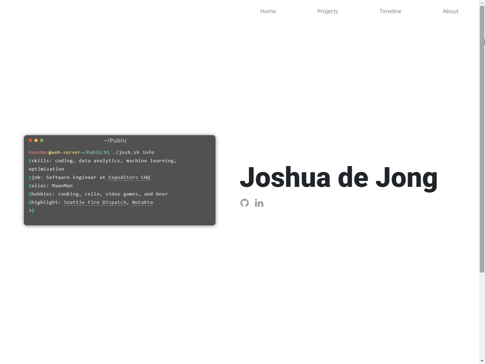
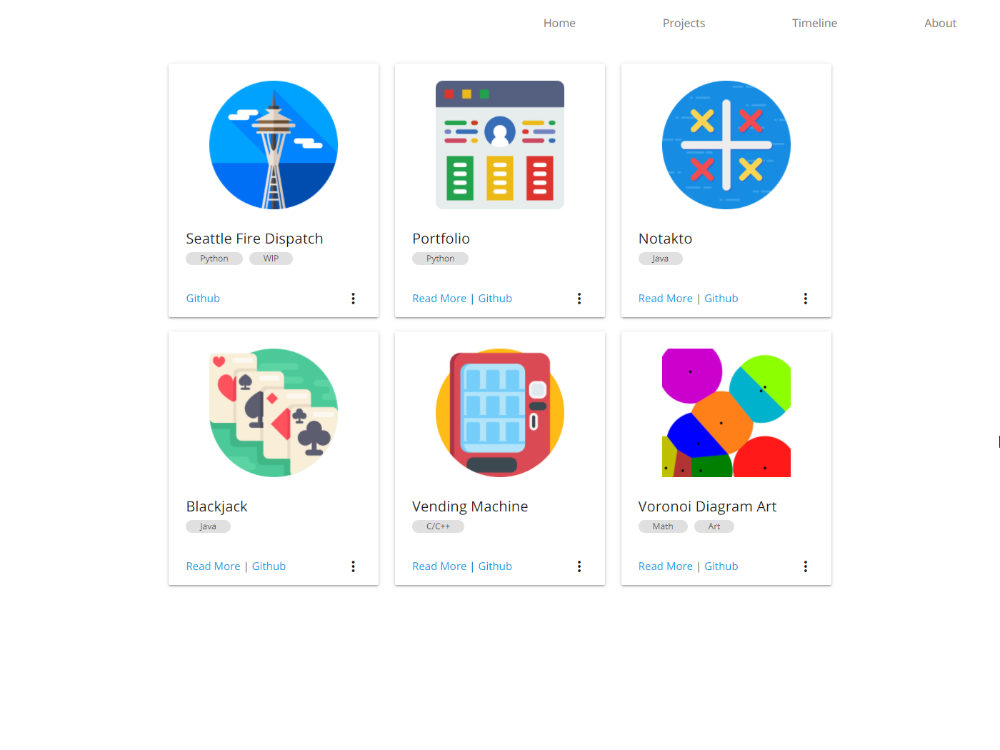
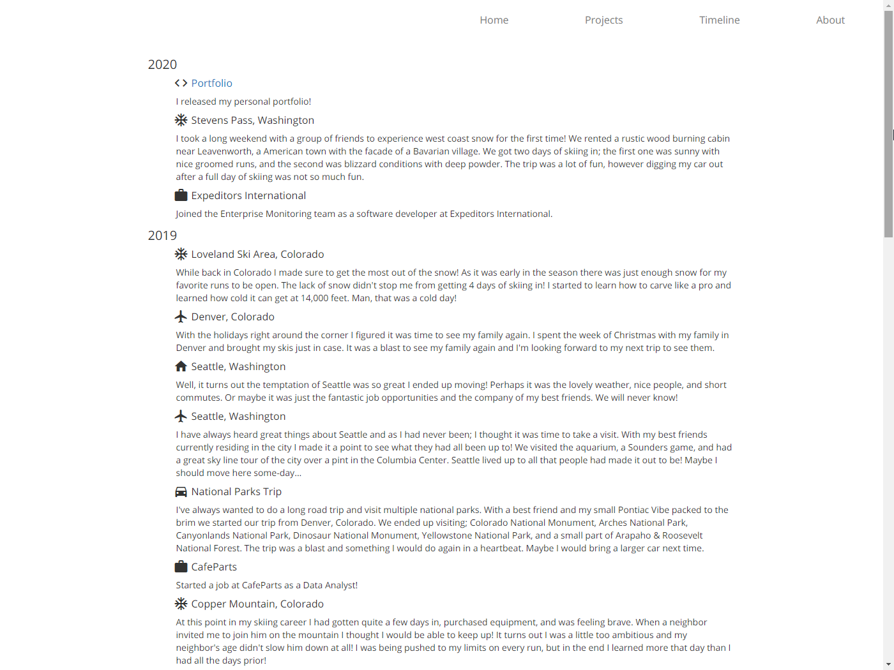
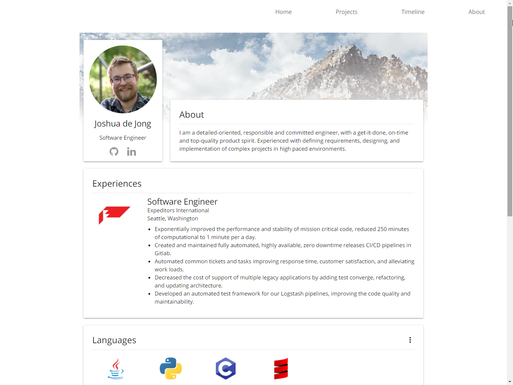
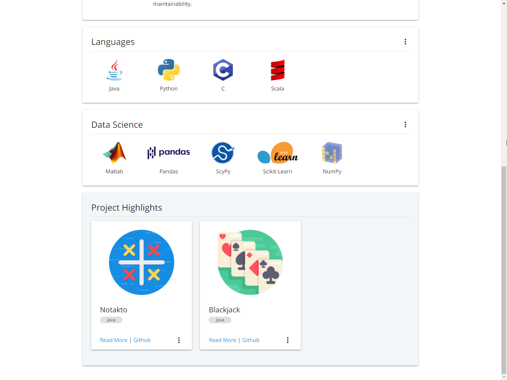

This is my personal portfolio for hosting my project and information about me!
 Others are free to fork this project and use it as their own.

Here are some key features of this portfolio!
 
* A fully reactive layout friendly for desktop, Iphone, and Android.
* A modern sleek design to show off you and your projects.
* An easy way to maintain and update the portfolio without knowing HTML, CSS, or JS. You only need to know Json, and Python!
* Dynamic page layouts to match your content - no need to fight the layout.
* Awesome animations to prevent your skills from just being plain text.
* Developed using Python, Flask, Jinja2, JS, HTML, CSS.

You can view my portfolio at [ManVanMaan.github.io](https://manvanmaan.github.io/)

## Photos
### Home Page

### Project Page

### Timeline Page

### About Page

...

# I want to use this!
You are welcome to use this repo for your own personal portfolio. 
Just fork this repo and update the content!
Below is information on how to change the portfolio's content using the `*.json` files.

## Run the Portfolio Locally
To run the portfolio locally use the `webApp/__init__.py` file. 

## Static Website Generator
This repo contains a static website generator script, `build_static.py`. 
The script builds a static version of the portfolio using the Frozen-Flask library found on [pypi.org](https://pypi.org/project/Frozen-Flask/).
All static files are built in `webApp/build` and then deployed to `../*.github.io`.

If you wish to host your own version of this portfolio using github pages. 
You  need to create a repo called `../<username>.github.io` which lives in the parent director of this project.
Then by running the `build_static.py` script all static files will be deployed to `../<username>.github.io`. 
After all files have been deployed make a push to your `<username>.github.io` repo with the changes. 
Your portfolio will appear at `https://<username>.github.io` after a few minutes of the push.

## Customize Content
The content of this portfolio is dynamically generated from json files and images in `static/images`. 
To add or modify content of this portfolio no knowledge of css, html, javascript, or flask is required. 
However, knowledge of any of these languages will allow for further customization.

### Json
The portfolio is broken up into 4 different json files which populate the content, those being: `about.json`, `projects.json`, `timeline.json`, and `terminal.json`.
All of which live inside of the `webApp/json` directory.

##### `about.json`
This json file is used to generate the home and the about page. The fields contained in the file are as follows

* `name`: [String] Your first and last name.
* `title`: [String] Your current job title or the job title you are seeking.
* `avatar`: [Image Path] A path to your profile/avatar image.
* `linkedin`: [URL] (Optional) An link to your Linkedin profile page.
* `github`: [URL] (Optional) A link to your Github profile page.
* `welcome`: [String Array] A greeting message for the home page. Each string can contain HTML and is displayed as a paragraph on the home page.
* `sumary`: [String Array] A summary of yourself found on the about page. Each string can contain HTML and is displayed as a paragraph on the about page.
* `education`: [List] (Optional) A list of degrees which you have obtained or are currently working on.
    * `universtiy`: [String] The name of the university.
    * `logo`: [Image Path] The path to the university's logo image.
    * `degree`: [String] The full name of degree. Example: "Bachelor of Science"
    * `degree_ab`: [String] (Optional) The abbreviation of the degree. Example: "PHD"
    * `focus`: [String] The area or focus of study. Example: "Computer Science"
    * `date_start`: [String] (Optional) The date you started the degree.
    * `date_end`: [String] (Optional) The date you finished the degree.
    * `activities`: [List] (Optional) Notable clubs/activities that you accomplished while studying. 
        * `group`: [String] (Optional) The group/club that you were part of.
        * `details`: [String Array] (Optional) Details or highlights of your accomplishments at the group/club. Each string will be a bullet point.
    * `courses`: [List] A list of the courses which you completed while studying your degree.
        * `subject`: [String] (Optional) The subject used to group classes together.
        * `classes`: [String Array] The name of the class. Each class will appear as a bullet with two per a line.
* `experience`: [List] Jobs or experiences you wish to show off.
    * `company`: [String] The company or organization the experience took place.
    * `image`: [Image Path] The company logo.
    * `title`: [String] The title you last held at this company or organization.
    * `location`: [String] The mail address of where you worked. Example: Seattle, Washington.
    * `summary`: [String Array] (Optional) Information about the position where each string is presented as a paragraph. Each string can contain HTML.
    * `details`: [String Array] (Optional) Information about the position where each string is presented as a bullet.
* `skills`: [List] (Optional) Hard or soft skills which you want to show off grouped by a topic.
    * `topic`: [String] The topic which all the skills fall under.
    * `info`: [List]
        * `name`: [String] The name of the skill.
        * `level`: [String] Your level of competence in the skill. From least experiences for most the choices are `novice`, `skilled`, `proficient`, `advanced`, `expert`.
        * `image`: [Image Path] The path to the images icon.
* `projects`: [String Array] (Optional) The names of project you wish to highlight. The project names must match a project name found in `project.json`.

#### `timeline.json`
This json file is used to generate the timeline page. The fields are as follows:

* `years`: [List]
    * `date`: [Integer] The year 
    * `events`: [List]
        * `name`: [String] The event's name.
        * `icon`: [String] The icon used to represent the event. The icons are [Material Icons](https://material.io/resources/icons/?style=baseline) by Google.
        * `desc`: [String] A one paragraph description of the event. HTML is allowed.
        * `link`: [URL] (Optional) You can provide an external link to the event.

#### `project.json`
This json file is used to generate the project page, project cards and modals. The fields are as follows:

* `projects`: [List]
    * `name`: [String] The name of the project.
    * `date`: [String] (Optional) The date the project was finished. If left empty the date will show as `Work in Progress`.
    * `icon`: [Image Path] The path to the projects icon.
    * `tags`: [String Array] (Optional) Tags or Hash-tags used to group similar projects. Note: filtering by tags does not work on the static version of this website.
    * `github`: [URL] (Optional) A github url to the project's page.
    * `short`: [String] A short description about the project.
    * `long` : [String Array] (Optional) A longer description about the project. Each string creates a new paragraph.
    * `html`: [Path] (Optional) A custom html page for the modal's content section.

    
#### `terminal.json`
This json file is used to populate the terminal seen on the home or index page of the portfolio. The fields are as follows:

* `title`: [String] The title of the terminal.
* `user`: [String] The user's alias.
* `at`: [String] The machine's alias.
* `path`: [String] The current directory the user is in.
* `caret`: [String] The output character.
* `content`: [String Array] The content to be written out. 
* `cursor`: [String] The input/cursor character.